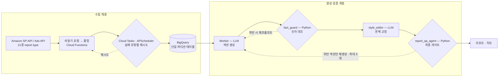

# 시스템 구조 — Amazon Ads Reporting Agent

← [개요](README.md) · [설계 판단](decisions.md) · [운영과 협업](operations.md)

핵심 구분은 **LLM 생성과 Python 검증의 분리**입니다. 아래 두 계층은 목적도 실패 방식도 다르기 때문에 따로 설계했습니다.

---

## 전체 흐름



---

## 수집 계층

Amazon의 리포트 API는 **요청과 수신이 분리된 비동기 방식**입니다. 리포트를 요청하면 job ID가 돌아오고, 완료될 때까지 폴링해야 합니다. 여기서 생기는 문제는 두 가지입니다.

1. 폴링 대기 시간이 길고 예측하기 어렵다 (Sales 리포트는 3일 초과 타임아웃 사례가 있었습니다)
2. 실패 유형이 여러 가지인데 대응 방식이 각각 다르다

그래서 수집을 **Cloud Functions(요청·폴링)와 Cloud Tasks·APScheduler(스케줄·재시도)로 분리**했습니다. 긴 작업이 하나 막혀도 다른 리포트 수집이 멈추지 않고, 실패 유형별로 재시도 정책을 다르게 걸 수 있습니다.

| 구성 요소 | 역할 |
|---|---|
| Cloud Functions | 리포트 비동기 요청 및 완료 폴링 |
| Cloud Tasks | 작업 큐 · 타임아웃과 4xx에 대한 재시도 |
| APScheduler | 정기 수집 스케줄 |
| BigQuery | 적재 대상. 21종 report type을 테이블로 관리 |

**저장 구조.** 초기에는 Amazon 관행을 따라 날짜 샤딩(`table_20260101` 형태) 구조를 썼습니다. 샤드가 239개까지 늘어나자 쿼리마다 대상 테이블을 조합해야 했고, 기간을 걸친 집계가 복잡해졌습니다. **단일 파티션 테이블로 마이그레이션**해 쿼리 경로를 하나로 만들었습니다.

**멱등성.** 같은 리포트를 여러 번 수집해도 중복 행이 쌓이지 않도록 적재를 멱등하게 설계했습니다. 재시도가 전제인 시스템에서 멱등성은 선택이 아니라 조건입니다.

---

## 생성·검증 계층

리포트 한 건은 네 단계를 거칩니다. **홀수 단계는 LLM, 짝수 단계는 Python**입니다.

```
Worker (LLM)  →  fact_guard (Python)  →  style_editor (LLM)  →  report_qa_agent (Python)
   서사 생성        숫자 대조 검증          문체 교정            최종 통과 게이트
```

| 단계 | 구현 | 규모 | 하는 일 |
|---|---|---|---|
| `Worker` | LLM | 610줄 | 리포트 섹션의 서사를 생성 |
| `fact_guard` | Python | 387줄 | 생성된 문장의 숫자를 원본 데이터와 대조 |
| `style_editor` | LLM | 321줄 | 문체·표현 교정 |
| `report_qa_agent` | Python | 816줄 | 최종 게이트. 통과하지 못하면 해당 섹션 재생성 |

검증·교정 전용 코드가 1,524줄로, **v3 전체 7,444줄의 20%**를 차지합니다.

### 검증이 실제로 하는 일

`fact_guard`는 생성된 문장에서 숫자를 추출해, BigQuery 원본 행으로 만든 표의 값 집합에 존재하는지 확인합니다. 없으면 통과하지 못하고 재프롬프트됩니다.

여기에 더해 **서술 패턴 자체를 차단하는 정규식**이 쌓여 있습니다. 예를 들어 실제로는 직접 전환이 존재하는데 "직접 매출 없음"이라고 서술하는 패턴은 정규식으로 걸러냅니다. 이건 한 번에 설계한 규칙이 아니라 [실제 장애](operations.md)가 남긴 것입니다.

`report_qa_agent`의 금칙어 규칙에는 `source_type`, `served_search_term`, `Drill-Down`, `Top of Search`, 구매 여정, 후광 효과 등 수십 개가 등록돼 있습니다. 모델이 데이터에 없는 전문 용어를 끌어와 쓰는 것을 막기 위한 목록입니다.

### 재시도 경계

- `fact_guard` 위반 → 해당 섹션 재프롬프트
- `report_qa_agent` 위반 → **위반 섹션만** 재생성, 최대 3회

리포트 전체를 다시 만들지 않고 문제 섹션만 재생성합니다. 통과한 섹션까지 매번 다시 생성하면 비용과 시간이 늘고, 이미 검증된 내용이 새 실행에서 달라질 수 있기 때문입니다.

---

## 오케스트레이션에 관한 note

에이전트 프레임워크(Google ADK)를 쓰지만, **오케스트레이션은 Python 직선 흐름**입니다. ADK는 LLM 호출 래퍼 역할만 합니다.

초기에는 ADK Coordinator가 리포트 5개 섹션을 자율 라우팅하는 multi-turn 구조로 만들었다가 되돌렸습니다. 그 판단의 배경은 [설계 판단](decisions.md#01-에이전트-자율-라우팅을-폐기했습니다)에 있습니다.

프레임워크에서 계속 쓰고 있는 것은 다음입니다.

- Vertex 네이티브 인증(ADC)
- tool calling 추상화
- `before/after_model_callback` 훅 — 토큰 사용량 로깅, `tool_config` 스왑
- 세션 state

---

## 멀티테넌트

복수의 광고 계정을 하나의 시스템에서 처리합니다. 관리하는 API 키는 41개이며 종류별로 나뉩니다.

| 키 종류 | 개수 |
|---|---|
| `sp_api` | 15 |
| `advertising` | 14 |
| `ads_v3` | 12 |

테넌트마다 계정 구조와 사용 가능한 API 조합이 다르기 때문에, 수집 대상을 테넌트별 설정으로 관리하고 리포트 생성도 테넌트 단위로 실행합니다.

---

*클라이언트사명, 내부 테이블 원본 스키마, 사내 시스템명은 [비공개 처리 기준](../../docs/how-to-read.md#비공개-처리-기준)에 따라 가렸습니다.*
