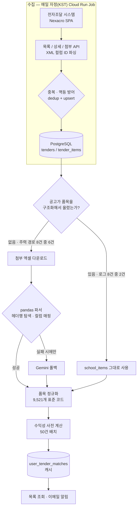

# 시스템 구조 — Bid Master

← [개요](README.md) · [설계 판단](decisions.md) · [운영과 협업](operations.md)

수집은 단순한 직선이지만, **품목 해석은 공고마다 갈립니다.** 이 분기가 시스템의 핵심 구조입니다.

---

## 전체 흐름



---

## 수집 계층

**실행.** 매일 자정(KST) Cloud Run Job(2Gi, asia-northeast3)으로 실행됩니다.

**대상.** 전자조달 시스템 1곳. Nexacro 기반 SPA라 HTML에 데이터가 없고, 화면은 XHR로 XML을 주고받습니다. 이 요청 스펙을 역설계해 **목록·상세·첨부 3개 엔드포인트**를 직접 호출합니다.

파싱은 XML **컬럼 ID 기반**입니다. 화면 레이아웃이나 DOM 구조가 바뀌어도 컬럼 ID는 유지되므로 화면 변경에 둔감합니다.

**실행 범위.** 지역코드 250개를 파싱해 보유하고 있지만, 운영은 서울·경기 2개 지역 × 축산 3개 키워드 = **하루 6조합**으로 좁혀 실행합니다. 클라이언트의 실제 취급 범위에 맞춘 설정입니다.

### 중복·재실행·유실 방어

지역별로 순회하는 구조라 같은 공고가 여러 번 수집됩니다. 방어를 계층으로 나눴습니다.

| 계층 | 방식 | 목적 |
|---|---|---|
| 1차 | `etn_bid_id` 인메모리 dedup | 같은 실행 안에서의 중복 제거 |
| 저장 | `bid_number` UNIQUE + upsert | 재실행 멱등성 |
| 비용 | 기수집 공고 상세조회 스킵 | 불필요한 API 호출과 LLM 비용 차단 |
| 네트워크 | 네트워크 오류만 선별 백오프 | 5 → 10 → 20초 |
| 시작 전 | DB 연결 확인 5회 | 유실 방지 |

마지막 항목이 중요합니다. **저장이 불가능한 상태에서 크롤링하면 수집한 데이터가 그대로 유실됩니다.** 그래서 크롤링을 시작하기 전에 DB 연결을 백오프로 확인하고, 실패하면 아예 시작하지 않습니다.

---

## 품목 해석 — 분기 구조

이 시스템에서 가장 중요한 분기는 **"공고가 품목을 구조화해서 올렸는가"** 입니다.

사이트별로 나누는 게 아니라 공고별로 나뉩니다. 같은 시스템에 올라오는 공고인데도 어떤 학교는 시스템 입력을 쓰고 어떤 학교는 엑셀만 첨부합니다.

### 경로 A — 구조화 품목 있음 (로그 8건 중 2건)

시스템에 등록된 `school_items`를 그대로 사용합니다. 파싱이 필요 없습니다.

### 경로 B — 첨부 엑셀 (로그 8건 중 6건, 주력 경로)

누적 **1,608건**을 처리한 경로입니다. 3단계로 시도합니다.

```
1. 헤더행 자동 탐색     — 엑셀마다 시작 행이 다름
2. 컬럼명 매핑          — "품명"·"품목명"·"식품명" 등 표기 차이 흡수
3. 인덱스 컬럼 판별     — 헤더가 없는 경우 위치로 추정
   ↓ 모두 실패할 때만
4. Gemini 폴백
```

**LLM을 마지막에 둔 이유는 비용과 재현성입니다.** 규칙으로 처리되는 대다수 파일에 매번 모델을 호출할 이유가 없고, 규칙은 같은 파일에 항상 같은 결과를 냅니다.

---

## 정규화

수집한 품목을 **9,521개 표준 식품코드**로 정규화합니다.

| 계층 | 개수 |
|---|---|
| 대분류 | 4 |
| 중분류 | 59 |
| 품목그룹 | 4,229 |
| 전체 코드 | 9,521 |

학교마다 같은 식재료를 다르게 표기하기 때문에, 표기명 그대로는 비교도 누적도 불가능합니다. 표준 코드로 옮겨야 **"이 품목의 단가가 지난달 대비 어떻게 변했는가"** 같은 질문에 답할 수 있습니다.

관련 마스터 데이터로 학교 1,416개교(묶음입찰 개별학교 306행)를 함께 관리합니다.

---

## 수익성 계산 — 저장 직후 사전 계산

계산식은 단순합니다.

```
하한가   = 단가 × 사정률
예상이익 = 하한가 합계 − 내물품가
```

문제는 **언제 계산하느냐**였습니다.

입찰 시즌이 매월 20일 전후 5~6일에 몰립니다. 조회 시점에 실시간 계산하면 사용자가 가장 몰리는 시점에 가장 무거운 계산이 겹칩니다.

그래서 수집 저장 직후 `calculate-matches`를 **50건 배치**로 트리거해 `user_tender_matches` 캐시에 미리 계산해 두고, 목록 조회는 캐시만 읽습니다.

---

## 알려진 이슈

엑셀 경로로 들어온 품목의 `school_id`가 NULL로 남는 케이스가 있습니다. `tender_schools`가 API 품목 경로에서만 insert되는 구조가 원인입니다. [남은 부채](decisions.md)로 기록해 두었습니다.

---

*조달 시스템의 내부 엔드포인트 경로와 파라미터 스펙, 클라이언트 단가 정보는 [비공개 처리 기준](../../docs/how-to-read.md#비공개-처리-기준)에 따라 가렸습니다.*
