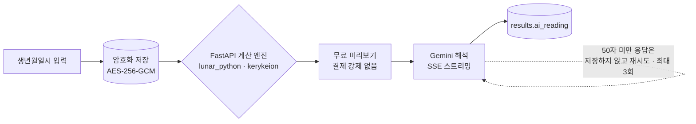
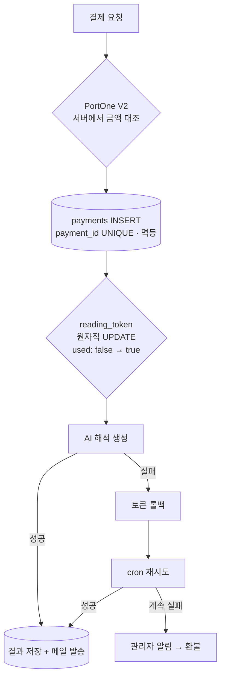

# 시스템 구조 — Byeoljari.com

← [개요](README.md) · [설계 판단](decisions.md) · [운영과 검증](operations.md)

두 개의 축이 있습니다. **결정론적 계산과 AI 해석의 분리**, 그리고 **결제에서 전달까지의 추적**입니다.

---

## 리딩 흐름



**입력.** 생년월일시는 개인정보이므로 AES-256-GCM으로 암호화해 저장하고, Supabase RLS로 접근을 제한합니다.

**계산.** 만세력 변환·절기 경계·행성 위치는 `lunar_python`과 `kerykeion`을 쓰는 FastAPI 엔진이 결정론적으로 산출합니다. 같은 입력에는 항상 같은 명식이 나옵니다.

**미리보기.** 계산 결과의 기본 형태는 결제 없이 보여줍니다. 광고 유입에서 즉시 결제를 강제하면 이탈한다는 것을 실제 집행으로 확인한 뒤 바꾼 구조입니다.

**해석.** Gemini가 산출된 명식을 해석하고 SSE로 스트리밍합니다. 긴 응답이라 점진적으로 보여주되, **50자 미만 응답은 저장하지 않고 자동 재시도**합니다. 사용자가 이탈하면 `AbortController`로 중단합니다.

---

## 결제 → 전달 흐름

이 시스템에서 가장 공들인 부분입니다. **환불은 fallback이 아니라 실패**라는 기준에서 설계했습니다.



### 각 단계의 방어

| 지점 | 방어 | 막는 것 |
|---|---|---|
| 결제 검증 | 서버에서 PortOne 거래 상태·금액 재대조 | 클라이언트가 보낸 금액 변조 |
| 결제 기록 | `payment_id` UNIQUE | 중복 처리 |
| 토큰 소비 | 원자적 UPDATE (`used=false → true`) | 같은 토큰 이중 사용 |
| 충전 처리 | UNIQUE 제약 + 23505 처리 | TOCTOU 레이스 |
| 게스트 결제 | 금액 상한 검증 | 무제한 금액 요청 |
| 복귀 경로 | 상대경로만 허용 | `returnUrl` open redirect |

**토큰을 먼저 잠그는 구조의 함정.** 토큰을 `used=true`로 먼저 바꾸고 AI를 호출하면, 호출 중 런타임이 끊겼을 때 그 주문은 **재시도 대상에서 아예 빠집니다.** 결제는 됐고 토큰은 소비됐는데 결과가 없는 상태가 됩니다.

그래서 실패 시 토큰을 롤백하고, cron이 다시 처리하고, 그래도 실패하면 관리자에게 알린 뒤 환불하는 순서를 만들었습니다.

**결제 수단.** PortOne V2로 카카오페이(회원)와 토스페이(비회원)를 지원합니다. 회원과 비회원의 흐름이 다르기 때문에 검증 경로도 나뉩니다.

---

## 가격 관리

`service_prices` 테이블이 **유일 권위 소스**입니다.

```
관리자 화면 → service_prices 테이블 → 결제 금액 검증 · 화면 표시
                     ↑
              코드 상수는 타입과 초기값 전용
```

가격을 코드에 두면 변경마다 배포가 필요하고, 광고 집행 중에는 가격 실험이 불가능해집니다. 사업 판단으로 자주 바뀌는 값을 배포 경로에서 빼냈습니다.

---

## 서비스 구성

11종의 유료·무료 서비스가 있습니다 — 사주, 점성술, 타로, 궁합, 일일운세 계열.

API 라우트는 36개이며 네 영역으로 나뉩니다.

| 영역 | 역할 |
|---|---|
| 결제 | 요청·검증·webhook·환불 |
| 리딩 | 계산 엔진 호출·AI 스트리밍 |
| 결과 | 저장된 리딩 조회·재열람 |
| 관리자 | 가격·매출·사용자·리딩 현황 |

---

## 알려진 부채

- **게스트 결제 webhook** — 결과의 `writeToken`을 검증할 수 없어 클라이언트 verify에 의존이 남아 있습니다
- **cron 스케줄 정의** — `vercel.json`에 crons 정의가 없습니다. 저장소 기준으로 자동 복구가 주기 실행된다는 보장은 아직 없습니다

두 항목 모두 [설계 판단](decisions.md)에 그대로 기록해 두었습니다. 외부 대시보드에서 돌고 있을 가능성은 확인되지 않았으므로 추측으로 적지 않았습니다.

---

*코드는 비공개 저장소에 있습니다. 개인 제품이므로 클라이언트 관련 비공개 처리는 해당되지 않습니다.*
