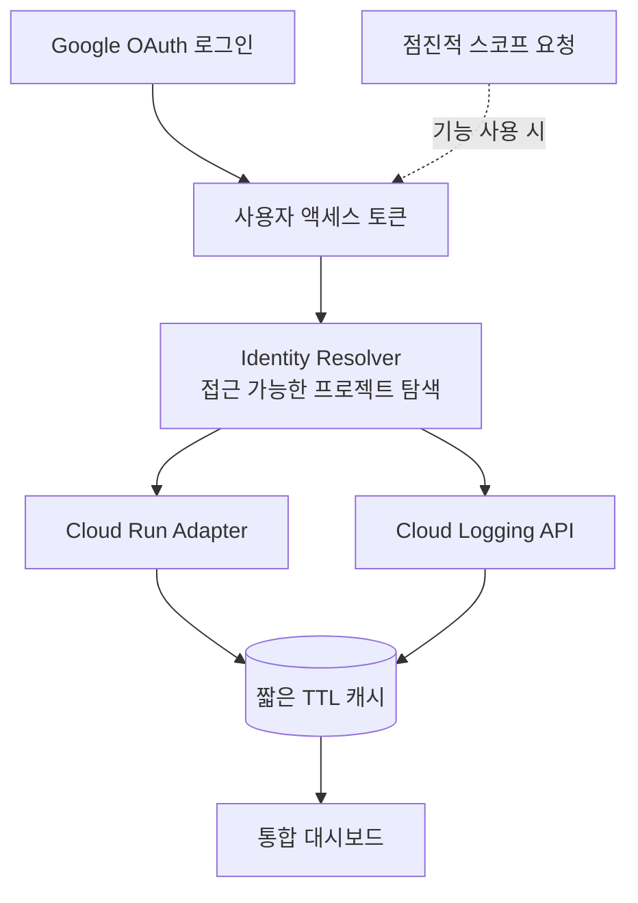

# 시스템 구조 — Cloud Run Monitor

← [개요](README.md)

---

## 전체 흐름



**서버가 보관하는 장기 자격 증명이 없습니다.** 모든 GCP 호출은 사용자 토큰으로 이뤄집니다.

---

## Bring Your Own Identity

### 일반적인 방식과의 비교

| | 서비스 계정 키 | BYOI (이 방식) |
|---|---|---|
| 온보딩 | 키 생성 → 역할 부여 → 다운로드 → 업로드 | Google 로그인 |
| 서버 보관 자격 증명 | JSON 키 (만료 없음) | 없음 (사용자 토큰만) |
| 권한 범위 | 부여한 역할 고정 | 사용자 IAM 그대로 |
| 권한 변경 반영 | 수동 재설정 | 자동 |
| 유출 시 영향 | 키 자체가 영구 인증 수단 | 토큰 만료로 제한적 |

### 권한이 자동으로 맞는다

이 구조의 가장 큰 이점입니다.

```
사용자가 프로젝트 A에 접근 권한 있음  → 대시보드에 A 보임
사용자가 프로젝트 B에 접근 권한 없음  → 대시보드에 B 안 보임
```

**별도의 권한 동기화 로직이 필요 없습니다.** GCP가 이미 판정하고, 도구는 그 결과를 따를 뿐입니다.

서비스 계정 방식에서는 "이 도구가 볼 수 있는 것"과 "이 사용자가 봐도 되는 것"이 다를 수 있고, 그 간극을 애플리케이션이 관리해야 합니다.

---

## Identity Resolver

로그인한 사용자가 **어떤 프로젝트에 접근할 수 있는지** 먼저 확인합니다.

사용자는 대개 자기가 어떤 프로젝트에 권한이 있는지 전부 기억하지 못합니다. 프로젝트 ID를 직접 입력하게 하는 대신, 접근 가능한 목록을 먼저 보여주고 고르게 합니다.

---

## 캐시 전략

**메타데이터를 복제하지 않습니다.**

| 방식 | 문제 |
|---|---|
| 자체 DB에 복제 | 서비스가 삭제됐는데 대시보드에 남음. 권한이 회수됐는데 여전히 보임 |
| 짧은 캐시 (채택) | 권한·상태 변경이 자연스럽게 반영됨 |

캐시 TTL을 짧게 두면 API 호출이 늘지만, **정합성 문제가 구조적으로 사라집니다.** 관측 도구에서 "실제와 다른 상태를 보여주는 것"은 도구를 못 쓰게 만드는 결함입니다.

동기화 로직을 만들고 유지하는 비용보다, 매번 물어보는 비용이 쌌습니다.

---

## 점진적 스코프

로그인 시점에 모든 권한을 요구하지 않습니다.

```
초기 로그인    → 프로젝트 목록 · 서비스 조회 스코프
로그를 열 때   → 로깅 읽기 스코프 추가 요청
```

**처음부터 큰 권한을 요구하면 사용자가 멈춥니다.** 무엇에 쓰는지 모르는 권한을 승인하기 어렵고, 특히 조직 계정에서는 관리자 승인이 필요할 수도 있습니다.

기능을 쓰는 시점에 요청하면 왜 필요한지가 맥락으로 설명됩니다.

---

## 이 구조의 한계

명시해 둡니다.

**사용자가 접속해 있을 때만 동작합니다.** 사용자 토큰으로 호출하므로, 사람이 없으면 API를 부를 주체가 없습니다.

따라서 다음은 이 구조로 만들 수 없습니다.

- 상시 모니터링과 이상 감지
- 알림 발송
- 백그라운드 이력 수집

이건 서비스 계정이 필요한 영역입니다. **탐색적 조회는 BYOI가 맞고, 상시 모니터링은 서비스 계정이 맞습니다.** 두 방식이 경쟁하는 것이 아니라 용도가 다릅니다.

---

*개인 실험 프로젝트이며 프로토타입 단계입니다.*
