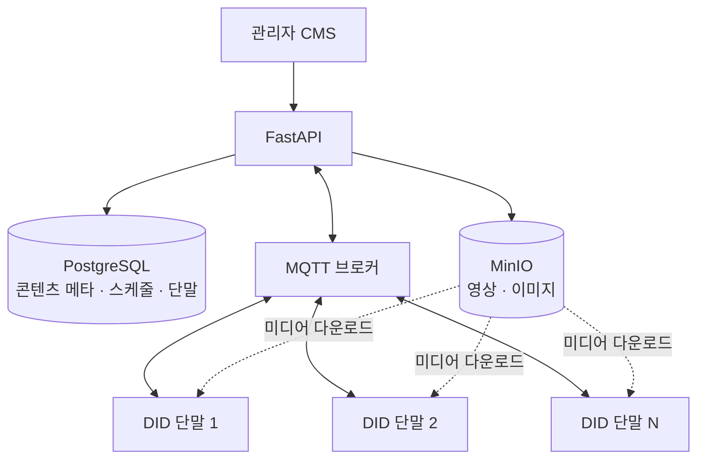

# 시스템 구조 — Digital Signage DID CMS

← [개요](README.md)

---

## 전체 구성



전체가 **내부망 안에서 완결**됩니다. 외부 인터넷 의존이 없습니다.

---

## 두 종류의 데이터, 두 개의 저장소

| 저장소 | 담는 것 | 특성 |
|---|---|---|
| PostgreSQL | 콘텐츠 메타, 스케줄, 단말 정보 | 작고 자주 조회·변경 |
| MinIO | 영상·이미지 원본 | 크고 드물게 변경 |

**분리한 이유**

1. **백업 주기가 다릅니다.** 메타데이터는 자주 백업해야 하고, 수십 GB의 미디어는 그럴 필요가 없습니다. 한 곳에 있으면 둘 다 무거운 주기를 따라야 합니다
2. **전송 경계가 다릅니다.** DB 쿼리는 밀리초 단위, 파일 전송은 초·분 단위입니다. 같은 커넥션 풀을 쓰면 파일 전송이 쿼리를 막습니다
3. **복구 시나리오가 다릅니다.** 메타데이터가 깨지면 시스템이 멈추고, 미디어 하나가 깨지면 그 콘텐츠만 영향받습니다

**MinIO를 고른 이유.** S3 호환 API를 쓰면서 **내부망에 직접 설치**할 수 있습니다. 폐쇄망 조건에서 클라우드 오브젝트 스토리지는 선택지가 아니었고, 파일시스템에 직접 저장하면 접근 제어와 확장이 어려워집니다.

---

## 단말 통신 — 왜 MQTT인가

단말과 서버 사이에 오가는 데이터는 이런 것들입니다.

- 단말이 살아 있는가 (heartbeat)
- 지금 무엇을 재생 중인가
- 새 스케줄이 있으니 갱신하라
- 즉시 이 콘텐츠로 전환하라

**작고 잦고 즉시성이 필요합니다.**

### HTTP 폴링과 비교

| 방식 | 문제 |
|---|---|
| HTTP 폴링 | 단말 수 × 폴링 빈도만큼 요청 발생. 그런데도 실시간성은 폴링 주기만큼 늦음 |
| MQTT | 연결을 유지하므로 서버가 즉시 push. 요청 폭증 없음 |

단말이 100대면 폴링은 30초마다 100번의 요청입니다. 그렇게 해도 명령 전달은 최대 30초 늦습니다. MQTT는 연결이 이미 열려 있으므로 즉시 전달됩니다.

**연결 상태 자체가 정보입니다.** MQTT는 연결이 끊기면 브로커가 그것을 압니다. 폴링에서는 "요청이 안 온 지 얼마나 됐는가"로 추정해야 하는 것을, 연결 기반에서는 바로 알 수 있습니다.

---

## 미디어 전달

미디어 파일은 MQTT로 보내지 않습니다. 메시지 브로커는 큰 페이로드에 적합하지 않습니다.

```
1. 서버 → 단말 (MQTT): "새 콘텐츠가 있다. 위치는 이것"
2. 단말 → MinIO (HTTP): 파일 다운로드
3. 단말 → 서버 (MQTT): "다운로드 완료, 재생 준비됨"
```

**제어는 MQTT, 데이터는 HTTP**로 나눈 구조입니다. 각 채널이 자기가 잘하는 것만 합니다.

---

## 폐쇄망 제약이 규정한 것

| 영역 | 일반 환경 | 이 프로젝트 |
|---|---|---|
| 오브젝트 스토리지 | S3 · GCS | MinIO 자체 호스팅 |
| 메시지 브로커 | 관리형 서비스 | 자체 설치 브로커 |
| 배포 | 클라우드 | On-premise |
| 모니터링 | SaaS | 내부 구성 |

외부 의존을 하나씩 내부 구성으로 바꾸는 작업이었습니다. 클라우드를 쓸 수 있었다면 훨씬 단순했겠지만, **그럴 수 없는 환경이 존재하고 거기서도 시스템은 돌아가야 합니다.**

---

*고객사, 설치 환경, 실제 스키마와 단말 사양은 [비공개 처리 기준](../../docs/how-to-read.md#비공개-처리-기준)에 따라 제외했습니다.*
