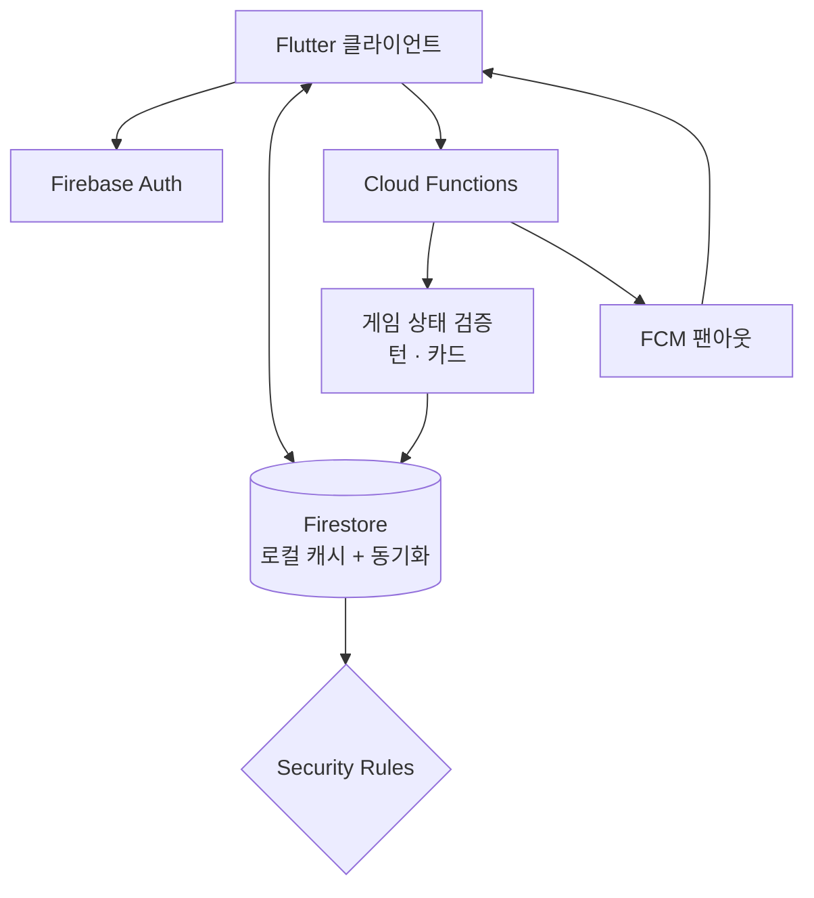
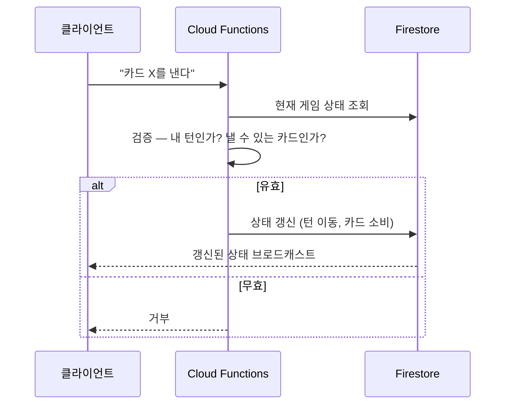

# 시스템 구조 — Dubby

← [개요](README.md)

---

## 전체 구성



---

## 기능별 일관성 요구

이 앱의 설계는 **기능마다 다른 일관성 수준**을 적용하는 데서 갈립니다.

| 기능 | 필요한 일관성 | 처리 |
|---|---|---|
| 채팅 | 최종적 일관성 | Firestore 직접 쓰기 + 로컬 캐시 |
| 스토리 | 최종적 일관성 | 동일 |
| 투표·반응 | 집계 정확성 | 서버 집계 |
| **카드게임** | **강한 일관성** | **Cloud Functions 검증 필수** |

전부에 같은 수준을 적용하면 과하거나 부족해집니다. 채팅에 서버 검증을 걸면 불필요하게 느려지고, 게임을 클라이언트에 맡기면 상태가 깨집니다.

---

## 게임 — 서버 권위 구조



**클라이언트는 요청만 하고 판정하지 않습니다.**

### 왜 서버 권위인가

| 클라이언트 판정의 문제 | 설명 |
|---|---|
| 조작 가능성 | 클라이언트 코드는 변조될 수 있습니다 |
| 상태 분기 | 두 클라이언트가 동시에 다른 판단을 내리면 게임 상태가 갈라집니다 |
| 경합 | 최대 8명이 동시에 액션을 보낼 수 있습니다 |

Cloud Functions가 유일한 판정자가 되면 모든 참여자가 같은 상태를 봅니다.

이 원칙은 [Byeoljari의 결제 검증](../byeoljari/architecture.md#각-단계의-방어)과 같습니다. **클라이언트가 보낸 결과를 신뢰하지 않고 서버에서 다시 판정합니다.**

---

## 오프라인 처리

모바일에서 연결 단절은 예외가 아니라 기본 조건입니다.

- 지하철·엘리베이터 진입
- 앱 백그라운드 전환
- Wi-Fi ↔ 셀룰러 전환

**"끊기면 에러"로 다루면 사용자는 하루에 몇 번씩 에러 화면을 봅니다.**

### 기능별 오프라인 동작

| 기능 | 오프라인에서 |
|---|---|
| 채팅 읽기 | 로컬 캐시로 동작 |
| 채팅 쓰기 | 큐에 쌓았다가 재연결 시 전송 |
| 스토리 조회 | 캐시된 것만 |
| **게임 액션** | **대기 — 서버 검증이 필요하므로 낙관적 처리 불가** |

Firestore의 로컬 캐시와 오프라인 지속성을 활용하되, **서버 권위가 필요한 액션은 예외로 뒀습니다.** 게임에서 낙관적 UI를 적용하면 재연결 후 상태가 되돌아가는 경험이 생기고, 이건 에러보다 나쁩니다.

---

## 알림 팬아웃

그룹 채팅과 반응은 하나의 이벤트가 여러 사용자에게 전달돼야 합니다.

```
이벤트 발생 → Cloud Functions → 수신 대상 결정 → FCM 발송
                                      ↑
                            본인 액션 제외
                            음소거된 방 제외
                            차단 관계 제외
```

**필터링을 서버에서 합니다.** 클라이언트에서 걸러내면 이미 기기까지 알림이 도착한 뒤이므로 배터리와 트래픽을 낭비하고, 잠금화면에 잠깐 뜨는 문제도 있습니다.

---

## 보안

**Firestore Security Rules**로 데이터 접근을 제한합니다.

Cloud Functions를 거치는 경로는 함수 안에서 검증하지만, 클라이언트가 Firestore에 직접 접근하는 경로(채팅 읽기·쓰기 등)는 Rules가 유일한 방어선입니다.

- 본인이 속한 방의 메시지만 읽기
- 본인 명의로만 쓰기
- 게임 상태 문서는 **클라이언트 직접 쓰기 금지** (Functions만 가능)

마지막 항목이 서버 권위 구조를 실제로 강제하는 지점입니다. Rules로 막지 않으면 클라이언트가 Functions를 우회해 상태를 직접 바꿀 수 있습니다.

---

*개인 제품이며 진행 중입니다. 코드는 비공개 저장소에 있습니다.*
