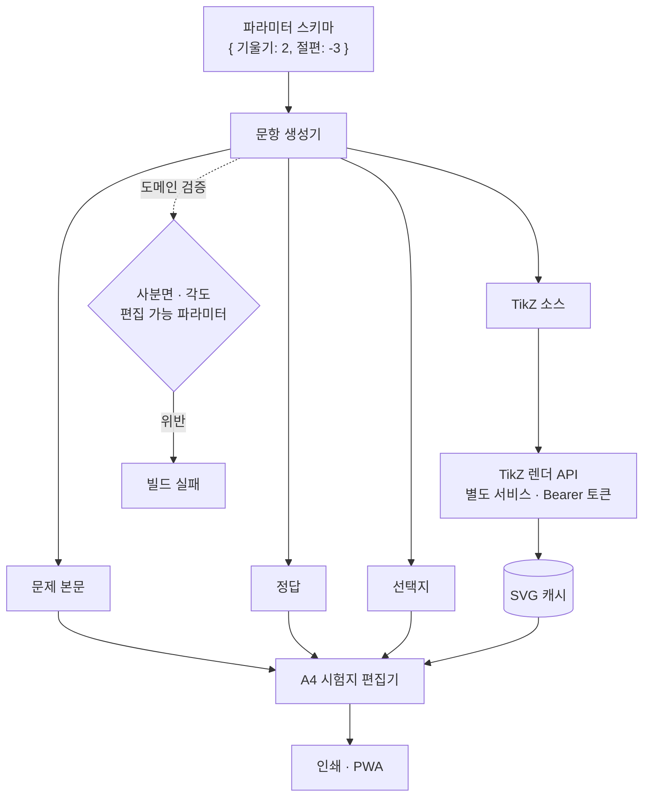

# 시스템 구조 — Exam Forge

← [개요](README.md) · [설계 판단](decisions.md)

---

## 전체 흐름



---

## 문항 = 생성기

이 시스템의 핵심 모델입니다.

### 일반적인 방식

```
문항 레코드
├── body: "기울기가 2인 일차함수..."
├── answer: "2"
├── choices: ["1", "2", "3", "4"]
└── image_url: "/graphs/slope-2.svg"
```

숫자를 바꾸려면 네 필드를 모두 수정해야 하고, 하나라도 놓치면 **틀린 문항**이 됩니다. 그리고 놓쳤다는 사실은 대개 인쇄한 뒤에 발견됩니다.

### 이 시스템의 방식

```
문항 정의 = f(파라미터) → { body, answer, choices, tikz }
```

파라미터만 저장하고 나머지는 전부 파생값입니다. **불일치가 구조적으로 불가능합니다.**

| 저장하는 것 | 계산하는 것 |
|---|---|
| 파라미터 값 | 문제 본문 |
| 생성기 정의 | 정답 |
| | 선택지 |
| | 도형 |

**선택지 생성이 특히 중요합니다.** 오답은 아무 숫자가 아니라 "그럴듯하게 틀린" 값이어야 합니다. 부호를 반대로 계산했을 때 나오는 값, 역수를 취했을 때 나오는 값처럼, **학생이 실제로 저지르는 실수에서 나오는 값**을 생성기가 만듭니다.

---

## TikZ 렌더링

수학 도형은 TikZ로 그립니다. 정밀하고 인쇄 품질이 좋습니다. 문제는 **TeX 바이너리가 필요하다**는 것입니다.

### 왜 분리했나

| 문제 | 설명 |
|---|---|
| 배포 무게 | TeX 배포판은 큽니다. 웹 앱 이미지에 넣으면 빌드와 배포가 느려집니다 |
| 보안 표면 | TeX는 매우 강력한 매크로 언어입니다. 임의 입력을 컴파일하는 것은 위험합니다 |
| 실행 특성 | 컴파일은 CPU 작업이고, 웹 요청 처리와 리소스 프로파일이 다릅니다 |

**렌더링을 별도 서비스로 분리하고, 원시 TikZ API는 서버 간 Bearer 토큰으로 보호**했습니다. 브라우저에서 직접 임의의 TikZ를 컴파일 요청할 수 없습니다.

### 캐시

```
TikZ 소스 → 해시 → 캐시 조회
              ├─ hit  → SVG 반환
              └─ miss → 컴파일 → SVG 저장 → 반환
```

같은 파라미터의 문항은 같은 TikZ를 만들고, 같은 TikZ는 같은 SVG가 됩니다. 컴파일은 느린 작업이라 캐시 효과가 큽니다.

---

## 도메인 검증

타입 검사로는 잡히지 않는 규칙을 자동 검증합니다.

| 검증 항목 | 예시 |
|---|---|
| 사분면 | 좌표가 문제에서 의도한 사분면에 있는가 |
| 각도 | 유효한 범위이며 도형이 성립하는가 |
| 편집 가능 파라미터 | 편집 가능하다고 표시한 값이 실제로 안전하게 변경 가능한가 |

**타입은 `angle: number`를 허용하지만 수학은 `-500도`를 허용하지 않습니다.** 도메인 규칙은 도메인 검증으로 따로 잡아야 합니다.

이 검증을 **빌드에 포함**했습니다. 규칙을 위반한 문항 정의는 배포되지 않습니다.

---

## 편집기와 인쇄

**A4 규격을 지키는 것이 요구사항**입니다. 시험지는 종이로 출력되고, 여백이나 페이지 나눔이 어긋나면 쓸 수 없습니다.

편집기는 화면에서 편집하되 **A4 지면을 기준 단위로** 동작합니다. 화면 레이아웃을 만들고 나중에 인쇄 CSS를 얹는 방식이 아니라, 처음부터 지면이 기준입니다.

**PWA로 배포**해 오프라인에서도 편집할 수 있습니다.

---

## 수식 표시

본문의 수식은 **KaTeX**로 렌더합니다. TikZ가 도형을 담당하고 KaTeX가 인라인 수식을 담당하는 분담입니다.

KaTeX는 브라우저에서 동작하므로 서버 왕복이 없고, 도형과 달리 수식은 컴파일 비용이 작습니다.

---

*개인 제품이며 진행 중입니다. 코드는 비공개 저장소에 있습니다.*
