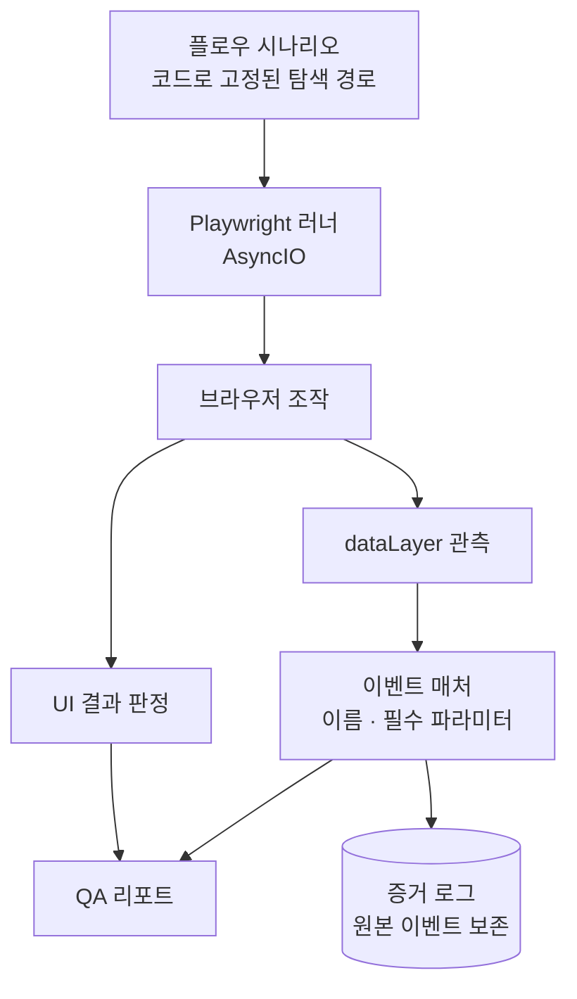

# 시스템 구조 — GA4 Event Validator

← [개요](README.md)

---

## 전체 흐름



**D와 E가 갈라지는 지점**이 이 도구의 핵심입니다. UI 판정과 계측 판정을 따로 냅니다.

---

## 시나리오 정의

탐색 경로를 코드로 고정합니다.

```
1. 상품 목록 진입
2. 특정 상품 선택         ← 매번 같은 상품
3. 장바구니 담기
4. 장바구니 진입
5. 결제 시작
```

각 단계에는 **대기 조건**이 함께 정의됩니다. "3초 기다린다"가 아니라 "특정 요소가 나타날 때까지 기다린다"입니다. 고정 시간 대기는 네트워크 상태에 따라 결과가 달라지고, 그러면 재현성이 깨집니다.

**왜 고정하나.** 수동 확인은 매번 다른 경로를 밟습니다. 이번엔 상품 A, 다음엔 상품 B를 눌러보면 두 실행 결과를 비교할 수 없습니다. 회귀를 잡으려면 같은 경로를 반복해야 합니다.

---

## 두 갈래 판정

이 도구가 다른 E2E 테스트와 다른 지점입니다.

| 판정 | 확인하는 것 | 실패 예시 |
|---|---|---|
| **UI 결과** | 화면이 의도대로 동작했는가 | 버튼이 반응하지 않음, 페이지 전환 실패 |
| **계측 결과** | 그 시점에 이벤트가 나갔는가 | `add_to_cart` 누락, `value` 파라미터 없음 |

두 판정이 독립적이므로 네 가지 조합이 나옵니다.

```
UI 성공 + 계측 성공  → 정상
UI 성공 + 계측 실패  → 조용히 깨진 계측  ★ 이걸 잡으려고 만든 도구
UI 실패 + 계측 실패  → 기능 자체가 깨짐
UI 실패 + 계측 성공  → 드묾. 대개 판정 로직 문제
```

두 번째 조합이 사람 눈으로 가장 발견하기 어려운 상태입니다. 화면은 멀쩡하니까요.

---

## 이벤트 매칭

`dataLayer`에 push된 이벤트를 관측해 기대값과 비교합니다.

| 검사 항목 | 내용 |
|---|---|
| 이벤트 이름 | 해당 시점에 나와야 할 이벤트가 존재하는가 |
| 필수 파라미터 | 정의된 파라미터가 모두 있는가 |
| 값의 형식 | 타입과 형식이 규격에 맞는가 |

**규칙 기반입니다.** 이벤트 규격은 미리 정의된 문서가 있고, 그것과 대조하는 일이므로 모델이 판단할 여지가 없습니다.

---

## 증거 보존

판정 결과만 저장하지 않고 **관측된 원본 이벤트를 함께 기록**합니다.

이유는 두 가지입니다.

1. **판정 근거 확인** — "누락됨"이라는 결론만 있으면 왜 그렇게 판정했는지 알 수 없습니다
2. **판정 로직 검증** — 매처가 틀렸을 가능성도 있습니다. 원본이 있으면 확인할 수 있습니다

자동 판정 도구를 신뢰하려면 판정을 다시 확인할 수 있어야 합니다. 근거 없는 자동화는 한 번 틀리는 순간 전부 버려집니다.

---

## 비동기 실행

AsyncIO 기반으로 여러 시나리오를 병렬 실행합니다. 브라우저 조작은 대기 시간이 대부분이라, 순차 실행하면 전체 시간이 대기 시간의 합이 됩니다.

---

*검증 대상 사이트, 실제 이벤트 규격, 클라이언트 정보는 [비공개 처리 기준](../../docs/how-to-read.md#비공개-처리-기준)에 따라 제외했습니다.*
