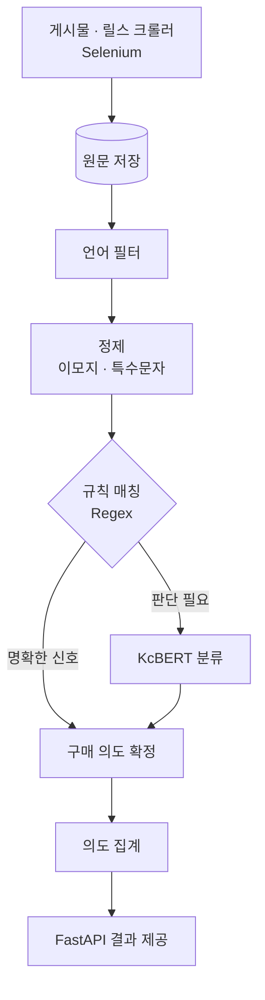

# 시스템 구조 — Instagram Purchase-intent Analyzer

← [개요](README.md)

---

## 전체 흐름



**B 지점에서 파이프라인이 끊어져 있습니다.** 수집과 분석이 원문 저장을 통해서만 연결되므로 각각 독립적으로 재실행할 수 있습니다.

---

## 수집과 분석의 분리

브라우저 기반 수집은 실패 요인이 많습니다.

- 로그인 세션 만료
- 무한 스크롤 로딩 지연
- 페이지 구조 변경
- 요청 제한

**이 실패가 분석까지 막으면 안 됩니다.** 그래서 원문을 먼저 저장하고, 정제와 분류는 저장된 데이터를 읽는 별도 단계로 두었습니다.

| 상황 | 재실행 대상 |
|---|---|
| 수집이 절반에서 끊김 | 수집만 이어서 |
| 분류 로직 수정 | 분류만 다시 |
| 정제 규칙 변경 | 정제부터 다시 |

전체를 다시 돌리지 않아도 되는 구조가, 실험을 반복할 수 있게 만드는 조건이었습니다.

---

## 정제 단계

댓글 데이터의 특성상 노이즈가 많습니다.

| 처리 | 대상 |
|---|---|
| 언어 필터 | 다국어가 섞인 댓글에서 대상 언어 분리 |
| 이모지 처리 | 이모지만 있는 댓글을 별도 분류 |
| 짧은 문장 보정 | 두세 글자 댓글의 처리 기준 |

이모지만 있는 댓글(`❤️❤️❤️`)은 반응이지 구매 의도가 아닙니다. 모델에 넘기면 오히려 잘못 판정할 수 있어 앞단에서 걸러냅니다.

---

## 하이브리드 분류

이 시스템의 핵심 구조입니다.

### 규칙이 담당하는 것

명확한 구매 신호는 표현이 정해져 있습니다.

```
"얼마", "가격", "어디서 사", "구매", "링크", "품절", "재입고" ...
```

이런 표현은 정규식으로 잡습니다. **모델보다 정확하고, 비용이 없고, 결과가 항상 같습니다.**

### 모델이 담당하는 것

규칙에 걸리지 않지만 문맥상 구매 의도가 있는 댓글입니다.

```
"지난번에 놓쳤는데 이번엔..."
"이거 저번에 고민하다 말았어요"
```

이런 것은 표현 패턴이 무한하므로 규칙으로 다룰 수 없습니다. **KcBERT**로 분류합니다.

### 왜 KcBERT인가

한국어 사전학습 모델은 여럿 있지만, KcBERT는 **댓글·구어체 데이터로 학습**됐습니다.

표준어 코퍼스(뉴스, 위키)로 학습한 모델은 줄임말·신조어·비문이 많은 소셜 댓글에서 성능이 떨어집니다. 도메인이 맞는 사전학습 모델을 고르는 것이 파인튜닝보다 먼저였습니다.

---

## 집계

개별 댓글의 분류를 모아 게시물·계정 단위 지표로 만듭니다.

| 지표 | 의미 |
|---|---|
| 구매 의도 비율 | 전체 댓글 중 구매 신호 비중 |
| 인플루언서별 비교 | 같은 상품에 대한 계정별 반응 차이 |

**댓글 수가 아니라 구매 의도 비율을 보는 것**이 이 도구의 목적입니다. 댓글 1,000개 중 의도가 5%인 계정과, 댓글 200개 중 25%인 계정은 다른 평가를 받아야 합니다.

---

*분석 대상 계정, 실제 규칙 목록, 클라이언트 정보는 [비공개 처리 기준](../../docs/how-to-read.md#비공개-처리-기준)에 따라 제외했습니다.*
