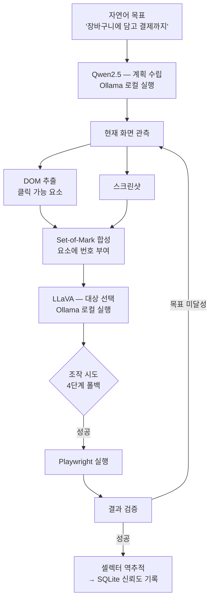
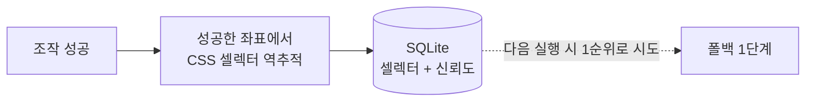

# 시스템 구조 — Local Browser Agent

← [개요](README.md) · [설계 판단](decisions.md)

---

## 전체 흐름



**클라우드 모델 API 호출은 이 흐름 어디에도 없습니다.** 두 모델 모두 Ollama에서 로컬 실행됩니다.

---

## 두 모델의 역할 분담

| 모델 | 역할 | 입력 | 출력 |
|---|---|---|---|
| **Qwen2.5** | 계획 수립 | 자연어 목표, 현재 상태 | 다음에 할 행동 |
| **LLaVA** | 시각 판단 | Set-of-Mark 이미지 | 조작할 요소 번호 |

계획과 시각 판단을 나눈 이유는 두 작업의 성격이 다르기 때문입니다. 계획은 텍스트 추론이고, 대상 선택은 이미지 이해입니다. 하나의 모델에 둘 다 맡기면 각각에서 약해집니다.

---

## Set-of-Mark — 픽셀과 DOM의 결합

이 시스템의 핵심 기법입니다.

### 왜 필요했나

| 접근 | 한계 |
|---|---|
| DOM만 사용 | 시각적으로 실제 클릭 가능한지, 화면에 보이는지 알 수 없음. 숨겨진 요소·오버레이에 취약 |
| 스크린샷만 사용 | 모델이 좌표를 추측해야 함. 좌표 공간 전체가 답의 후보라 정확도가 낮음 |

### 어떻게 동작하나

```
1. Playwright로 클릭 가능한 DOM 요소 추출
   → 각 요소의 bounding box 좌표 확보

2. 스크린샷 위 해당 좌표에 번호 오버레이 렌더링
   → [1] 검색창  [2] 로그인  [3] 장바구니 ...

3. LLaVA에게 질문
   → "장바구니에 담으려면 몇 번을 클릭해야 하나?"

4. 번호 → DOM 요소 → Playwright 조작
```

모델의 답이 **번호 하나**로 제한됩니다. 좌표를 지어낼 여지가 없고, 답이 유효한지 즉시 검증할 수 있습니다.

---

## 4단계 폴백

한 번에 성공하지 못하는 것을 전제로 설계했습니다.

| 순서 | 방식 | 비용 | 언제 성공하나 |
|---|---|---|---|
| 1 | 학습된 셀렉터 | 가장 낮음 | 과거에 같은 사이트를 다뤄본 경우 |
| 2 | Vision (LLaVA) | 중간 | 시각적으로 명확한 요소 |
| 3 | 텍스트 매칭 | 낮음 | 버튼 라벨이 예측 가능한 경우 |
| 4 | 좌표 클릭 | 낮음 | 최후 수단 |

**순서가 비용 순이 아니라 신뢰도 순인 지점이 있습니다.** 학습된 셀렉터를 1번에 둔 것은 비용도 낮고 신뢰도도 높기 때문이지만, Vision을 텍스트 매칭보다 앞에 둔 것은 비용이 더 들어도 정확하기 때문입니다.

---

## 학습 루프



성공한 좌표가 어떤 DOM 요소였는지 역추적해 CSS 셀렉터를 만들고, 신뢰도와 함께 SQLite에 저장합니다.

**같은 사이트를 다시 방문하면 1번 경로가 먼저 시도됩니다.** 실행할수록 Vision 호출이 줄어들고 속도가 올라갑니다. 셀렉터가 더 이상 동작하지 않으면 신뢰도가 내려가고 자연스럽게 다른 경로로 넘어갑니다.

---

## 계측 검증 적용

실제 커머스 사이트의 사용자 플로우를 자율 탐색하며 `dataLayer` 이벤트를 수집하는 용도로 확장했습니다.

```
자연어 목표 → 자율 탐색 → 각 단계에서 dataLayer 관측 → 이벤트 수집·기록
```

- 대상: 국내 주얼리 브랜드, 글로벌 F&B 프랜차이즈의 모바일 웹
- 결과: 내부 실행 기준 33개 이벤트 중 **80.5% 자동 검증 커버리지**

시나리오를 코드로 고정하는 방향은 [GA4 Event Validator](../ga4-validator/)로 분리해 발전시켰습니다. 자율 탐색은 커버리지를 넓히는 데 유리하고, 고정 시나리오는 재현성에 유리합니다.

---

*적용 대상 브랜드명은 [비공개 처리 기준](../../docs/how-to-read.md#비공개-처리-기준)에 따라 업종 표현으로 대체했습니다.*
