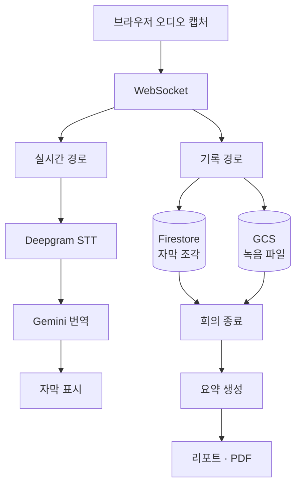

# 시스템 구조 — MeetSub

← [개요](README.md)

---

## 두 갈래 경로



**왼쪽은 지연이 목표, 오른쪽은 정확성이 목표**입니다. 같은 입력에서 갈라져 서로 간섭하지 않습니다.

---

## 실시간 경로

목표는 하나입니다. **말과 자막 사이의 지연을 최소화한다.**

| 단계 | 선택 |
|---|---|
| 전송 | WebSocket — 요청/응답이 아닌 지속 연결 |
| STT | Deepgram — 스트리밍 인식 |
| 번역 | Gemini |

**HTTP가 아닌 WebSocket인 이유.** 오디오는 끊임없이 흐르는 데이터입니다. 요청-응답 모델로 자르면 매 요청의 연결 수립 비용이 지연에 그대로 더해집니다.

**스트리밍 STT인 이유.** 발화가 끝날 때까지 기다렸다 인식하면, 긴 문장에서 자막이 통째로 늦게 나옵니다. 스트리밍은 중간 결과를 먼저 주고 확정되면 갱신합니다.

이 경로에는 **무거운 후처리를 붙이지 않습니다.** 문맥 교정이나 용어 통일 같은 것을 넣으면 정확해지지만 느려지고, 느린 자막은 자막이 아닙니다.

---

## 기록 경로

목표는 **완결성과 정확성**입니다.

| 대상 | 저장소 |
|---|---|
| 자막 조각 | Firestore |
| 녹음 파일 | GCS |

회의가 진행되는 동안 조각을 계속 쌓고, **회의가 끝난 뒤** 요약과 리포트를 생성합니다.

여기서는 시간을 써도 됩니다. 전체 맥락을 보고 요약할 수 있고, 앞뒤를 참조해 인식 오류를 바로잡을 수 있습니다. 실시간 경로가 놓친 것을 여기서 회복합니다.

---

## 세션 단위 추적

이 시스템의 뼈대입니다.

```
회의 ID
├── 브라우저 연결 (여러 번 끊기고 이어질 수 있음)
├── 자막 조각 (타임스탬프 순)
├── 녹음 파일
└── 최종 리포트
```

**모든 산출물이 하나의 회의 ID에 묶입니다.**

### 왜 필요한가

실시간 스트리밍에서 연결은 끊깁니다.

- 네트워크가 불안정할 때
- 사용자가 탭을 잠시 닫을 때
- 서버 인스턴스가 재시작될 때

**끊기지 않게 만들 수는 없습니다.** 대신 끊겼을 때 이어붙일 수 있어야 합니다. 세션 ID를 축으로 두면 재연결한 클라이언트가 어디까지 받았는지 확인하고 그 뒤부터 이어받을 수 있습니다.

연결 단위로 데이터를 관리했다면, 끊기는 순간 그 이전 자막과의 관계가 사라졌을 겁니다.

---

## 배포

**Cloud Run**에 배포했습니다.

| 요구 | 대응 |
|---|---|
| 세션 수에 따른 스케일 | Cloud Run 자동 스케일링 |
| WebSocket 지속 연결 | 장시간 연결 지원 |
| 회의가 없을 때 | 인스턴스 축소 |

회의 도구는 사용 패턴이 몰립니다. 업무 시간에 집중되고 밤에는 거의 없습니다. 상시 인스턴스를 띄워 두는 것보다 요청에 따라 늘고 주는 편이 맞았습니다.

---

## 스토리지 수명 주기

녹음 파일은 용량이 큽니다. 회의가 쌓일수록 저장 비용이 선형으로 늘어납니다.

원본 녹음과 최종 리포트의 보존 기간을 다르게 두어, **리포트는 오래 남기고 원본은 일정 기간 후 정리**하는 구조를 잡았습니다.

---

*개인 제품이며 진행 중입니다. 코드는 비공개 저장소에 있습니다.*
