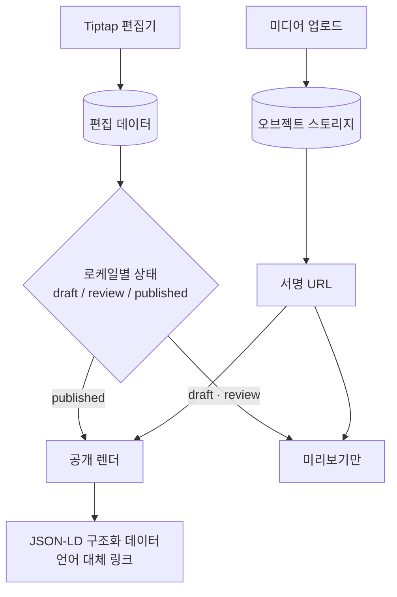

# 시스템 구조 — Multilingual Blog CMS

← [개요](README.md) · [설계 판단](decisions.md)

> 비공개 프로젝트입니다. 실제 스키마와 도메인은 공개하지 않고, 설계 판단을 설명하는 데 필요한 수준으로만 구조를 기술합니다.

---

## 전체 흐름



---

## 로케일별 상태 머신

이 시스템의 핵심 구조입니다.

일반적인 모델은 게시물 하나에 `published` 하나를 둡니다. 이 시스템은 **각 로케일이 자기 상태를 가집니다.**

```
게시물
├── ko : published    ← 공개 중
├── en : review       ← 검수 중, 공개 안 됨
└── ja : draft        ← 번역 시작 전
```

| 상태 | 의미 | 공개 여부 |
|---|---|---|
| `draft` | 작성·번역 중 | ✗ |
| `review` | 검수 중 | ✗ (미리보기만) |
| `published` | 발행됨 | ✓ |

공개 페이지는 요청된 언어의 상태를 확인해 노출 여부를 결정합니다. 준비되지 않은 언어는 빈 페이지를 보여주는 대신 정해진 폴백 규칙을 따릅니다.

**이 구조가 필요했던 이유는 운영 현실입니다.** 언어마다 번역자가 다르고, 검수 담당이 다르고, 마감이 다릅니다. 하나의 플래그로 묶으면 그 차이를 표현할 수 없고, 운영자는 시스템 밖에서 상태를 관리하게 됩니다.

---

## 편집기와 발행 결과의 분리

Tiptap은 편집 상태를 자체 문서 모델로 관리합니다. 이것을 그대로 공개 렌더에 쓰면 두 가지가 섞입니다.

- 편집 중인 미완성 내용
- 발행이 확정된 내용

**두 경로를 분리했습니다.**

| 경로 | 소스 | 접근 |
|---|---|---|
| 미리보기 | 편집 데이터 | 권한 있는 사용자만 |
| 공개 렌더 | 발행 확정 데이터 | 누구나 |

편집기에서 무엇을 하든 공개 페이지에 즉시 반영되지 않습니다. 발행이라는 명시적 행위가 경계를 만듭니다.

---

## 미디어

이미지·파일은 오브젝트 스토리지에 두고 **서명 URL**로 접근합니다.

발행 전 콘텐츠에 첨부된 미디어가 URL 추측만으로 노출되면, 발행 상태 관리가 무의미해집니다. 서명 URL은 만료 시간이 있어 링크가 유출돼도 영구 접근이 되지 않습니다.

---

## SEO 구조화 데이터

다국어 사이트는 검색엔진에 **언어 간 관계**를 알려줘야 합니다. 그러지 않으면 같은 내용의 여러 언어 페이지가 중복 콘텐츠로 취급될 수 있습니다.

발행 시점에 생성하는 것들입니다.

- **JSON-LD** — 문서 타입, 작성자, 발행일 등 구조화 데이터
- **언어 대체 링크** — 이 페이지의 다른 언어 버전 위치

발행되지 않은 언어는 대체 링크에 포함하지 않습니다. 존재하지 않는 페이지를 가리키면 오히려 해가 됩니다.

---

## 권한

편집·검수·발행의 역할 경계를 분리했습니다. 번역자가 발행까지 할 수 있으면 검수 단계가 형식적인 것이 됩니다. 상태 머신을 만든 의미가 권한 구조와 맞아야 실제로 지켜집니다.

---

*고객명, 도메인, 실제 스키마와 운영 데이터는 [비공개 처리 기준](../../docs/how-to-read.md#비공개-처리-기준)에 따라 공개하지 않습니다.*
