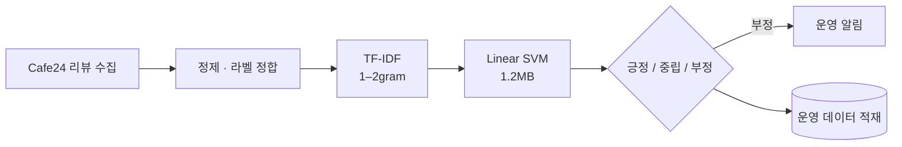

# 시스템 구조 — Review Sentiment Classifier

← [개요](README.md) · [설계 판단](decisions.md)

---

## 전체 흐름

추론은 Flask API로 제공합니다. 외부 모델 API 호출이 없으므로 **요청당 네트워크 왕복이 사라집니다.**

---

## 학습 파이프라인

### 데이터

AI-Hub의 라벨링된 커머스 리뷰 데이터를 사용했습니다.

| 구성 | 내용 |
|---|---|
| 카테고리 | 5개 커머스 카테고리 |
| 규모 | 약 10만 건 |
| 클래스 | 긍정 · 중립 · 부정 (3-class) |

**처음에는 한 도메인으로만 학습했다가 실패했습니다.** 그 경위는 [설계 판단 02](decisions.md#02-도메인-다양성을-정확도보다-먼저-확보했습니다)에 있습니다.

### 특징 추출

**TF-IDF 1–2gram**을 사용했습니다.

- 1gram — 단어 단위. "별로", "최고" 같은 단독 신호
- 2gram — 인접 단어쌍. "안 좋다", "생각보다 괜찮" 같은 조합 신호

한국어 리뷰에서 부정 표현은 종종 두 단어에 걸쳐 나타납니다. 1gram만 쓰면 "좋다"가 긍정 신호로 잡히는 문제가 있어 2gram을 함께 넣었습니다.

### 모델 선택

Linear SVM과 Logistic Regression을 비교했습니다.

| 모델 | 선택 |
|---|---|
| Linear SVM | ✅ 채택 |
| Logistic Regression | 비교군 |

학습이 수십 초에 끝나기 때문에 **파라미터를 여러 번 조정하며 빠르게 실험**할 수 있었습니다. 큰 모델이었다면 한 번의 실험에 몇 시간이 들었을 것이고, 그러면 이 정도로 여러 조합을 시도하지 못했을 겁니다.

### 평가

작은 테스트셋은 실행마다 결과가 흔들립니다. 그래서 두 가지를 고정했습니다.

- **고정된 테스트 분할** — 실험 간 비교가 가능하도록
- **클래스별 지표** — 전체 정확도만 보면 특정 클래스의 실패가 가려짐

최종 결과는 고정 테스트 분할 기준 **정확도 86.0%** 입니다.

---

## 서빙

| 항목 | 값 |
|---|---|
| 프레임워크 | Flask |
| 모델 크기 | 1.2MB |
| 추론 시간 | 약 10ms |

**모델 크기가 배포 특성을 바꿉니다.** 1.2MB 아티팩트는 서버리스 환경(Cloud Run, Lambda)에서 콜드 스타트가 빠르고, 인스턴스를 자유롭게 늘릴 수 있습니다. 수 GB짜리 모델을 서빙할 때 필요한 워밍업이나 상시 인스턴스가 필요 없습니다.

---

## 비용 구조 비교

월 10만 건 처리 기준 추정입니다.

| 방식 | 건당 | 월 |
|---|---|---|
| 범용 LLM API | 약 8원 | 약 80만원 |
| 자체 경량 모델 | 약 0.01원 | 약 1천원 |

**이 수치는 추정입니다.** 계산 근거는 월 10만 건 처리량과 당시 API 단가이며, 실제 청구액이 아닙니다. 자체 모델 비용에는 서버 운영비가 포함되어 있고 학습 비용은 일회성으로 제외했습니다.

---

*학습 데이터 세부 구성과 클라이언트 정보는 [비공개 처리 기준](../../docs/how-to-read.md#비공개-처리-기준)에 따라 제외했습니다.*
