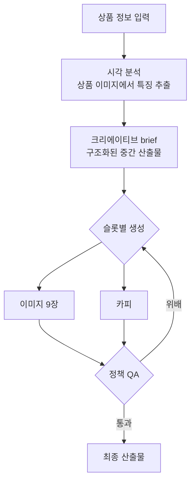

# 시스템 구조 — Snap-p

← [개요](README.md)

---

## 전체 흐름



핵심은 **C 단계**입니다. 입력에서 생성으로 바로 가지 않고 기획서를 거칩니다.

---

## 왜 brief를 중간에 두었나

생성형 파이프라인의 흔한 구조는 이렇습니다.

```
입력 → [블랙박스] → 결과
```

결과가 나쁘면 할 수 있는 게 프롬프트를 다시 굴리는 것뿐입니다. 무엇이 잘못됐는지 알 수 없습니다.

brief를 넣으면 이렇게 됩니다.

```
입력 → brief → 생성 → 결과
        ↑
   여기서 확인·수정 가능
```

| 얻은 것 | 설명 |
|---|---|
| 검증 지점 | 이미지를 만들기 전에 방향이 맞는지 확인 |
| 추적 지점 | 결과가 나쁠 때 brief가 문제인지 생성이 문제인지 구분 |
| 재사용 | 같은 brief로 다른 스타일의 이미지 재생성 |

brief에는 상품 특징, 타깃, 판매 포인트가 **구조화된 형태**로 들어갑니다. 자유 서술이 아니라 필드가 정해진 데이터입니다.

---

## 슬롯 기반 생성

9장의 이미지가 각각 다른 역할을 하도록 **슬롯별 목적을 고정**했습니다.

| 슬롯 유형 | 목적 |
|---|---|
| 썸네일 | 검색 결과에서 클릭 유도 |
| 장점 | 핵심 판매 포인트 전달 |
| 사용 장면 | 실제 사용 맥락 제시 |
| 상세 정보 | 스펙·구성 안내 |

**슬롯이 없으면 생기는 문제.** "이 상품의 리스팅 이미지 9장을 만들어라"라고 하면 모델은 비슷한 것 9장을 만듭니다. 각각이 무엇을 담당해야 하는지 모르기 때문입니다.

슬롯별로 목적을 주면 각 생성이 좁은 목표를 갖습니다. 모델은 좁은 목표에서 훨씬 잘합니다.

---

## 현지화

판매 국가별로 프롬프트를 다르게 구성합니다. 단순 번역이 아니라, 시장마다 강조점과 표현 관행이 다르기 때문입니다.

brief는 공통으로 두고 **로케일별 프롬프트만 교체**하는 구조입니다. 상품에 대한 판단(특징·타깃·판매 포인트)은 시장이 달라도 유지되고, 그것을 표현하는 방식만 바뀝니다.

---

## 정책 게이트

아마존은 리스팅 이미지에 대한 정책을 두고 있습니다. 만든 뒤 반려당하면 처음부터 다시 해야 합니다.

**검수를 파이프라인 안에 넣었습니다.**

| 검사 | 내용 |
|---|---|
| 정책 게이트 | 아마존 리스팅 정책 위배 여부 |
| 이미지 품질 QA | 해상도, 구도, 결함 |

위배가 감지되면 해당 슬롯만 재생성합니다. 9장 전체를 다시 만들지 않습니다.

---

## 구현 구성

| 영역 | 스택 |
|---|---|
| 프론트엔드 | Next.js 16 · React 19 |
| 데이터 | Prisma |
| 생성 | Gemini |
| 저장소 구조 | Monorepo |

---

*재직 중 진행한 프로젝트로 코드와 실제 프롬프트는 공개하지 않습니다. 클라이언트 상품 정보는 [비공개 처리 기준](../../docs/how-to-read.md#비공개-처리-기준)에 따라 제외했습니다.*
