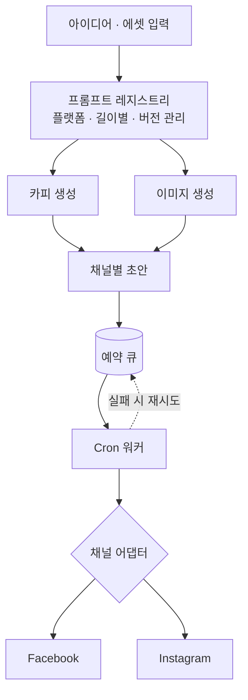

# 시스템 구조 — SNS EasyUp

← [개요](README.md)

---

## 전체 흐름



---

## 프롬프트 레지스트리

프롬프트를 코드가 아니라 **교체 가능한 데이터**로 관리합니다.

```
레지스트리
├── instagram / short   (v3)
├── instagram / long    (v2)
├── facebook  / default (v4)
└── ...
```

| 키 | 설명 |
|---|---|
| 플랫폼 | Instagram, Facebook … |
| 길이·형식 | 짧은 캡션, 긴 본문 |
| 버전 | 어떤 프롬프트로 만든 결과인지 추적 |

**왜 분리했나.** 프롬프트는 계속 손보게 되는 대상입니다. 코드에 박아 두면 문구 톤을 조금 바꾸는 데도 배포가 필요하고, 그러면 실험 주기가 배포 주기에 묶입니다.

**버전을 남기는 이유.** 결과 품질이 갑자기 나빠졌을 때 무엇이 바뀌었는지 확인할 수 있어야 합니다. 생성 결과에 사용된 프롬프트 버전을 함께 기록합니다.

---

## 채널 어댑터

Facebook과 Instagram은 같은 Meta 플랫폼이지만 실제 게시 규격이 다릅니다.

| 차이 | 내용 |
|---|---|
| 인증 | 필요한 권한 범위와 토큰 종류 |
| 미디어 | 이미지 비율·크기 요구 |
| 텍스트 | 캡션 길이 제한 |
| 예약 | 예약 발행 지원 방식 |

**이 차이를 공통 작성 흐름 밖으로 격리했습니다.**

```
공통 작성 흐름          어댑터              채널
────────────────       ─────────          ────────
{ 본문, 이미지 }  →   FB 어댑터    →   Facebook API
                  →   IG 어댑터    →   Instagram API
```

사용자는 하나의 편집 화면에서 작업하고, 어댑터가 각 채널의 규격으로 변환합니다. **채널을 추가할 때 어댑터만 쓰면 되는 구조**를 목표로 했습니다.

이 격리가 없으면 작성 화면에 채널별 분기가 쌓이고, 채널이 늘수록 화면 코드가 복잡해집니다.

---

## BYO API 키

사용자가 자기 API 키를 넣어 씁니다.

| 관점 | 이유 |
|---|---|
| 서비스 | 실험 단계에서 생성 비용을 부담할 이유가 없음 |
| 사용자 | 사용량과 비용이 투명하게 보임 |
| 보안 | 키는 사용자 계정 범위에 저장 |

---

## 예약 발행과 복구

```
초안 작성 → 예약 시각 지정 → 큐 적재
                                ↓
                          Cron 워커가 주기 확인
                                ↓
                    발행 시도 ─┬─ 성공 → 완료 기록
                              └─ 실패 → 재시도 대상으로 남김
```

**실패를 전제로 만들었습니다.** 외부 API 발행은 토큰 만료, 요청 제한, 일시 장애로 실패합니다. 한 번 실패했다고 그 게시물이 사라지면 안 됩니다.

큐에 남겨 두고 다시 시도하되, 계속 실패하는 건은 사용자가 확인할 수 있게 표시합니다.

---

## 이 문서의 범위

Lab 프로젝트입니다. 다음은 다루지 않았습니다.

- 실사용 규모에서의 API 요청 제한 대응
- 계정 정지 리스크 관리
- 발행 실패율 측정

구조가 성립하는지를 확인한 실험이며, 운영 시스템의 요구는 별개입니다.

---

*개인 실험 프로젝트입니다. 코드는 비공개 저장소에 있습니다.*
