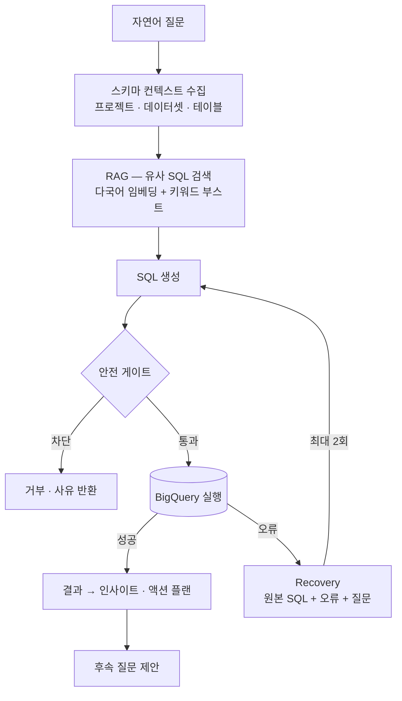

# 시스템 구조 — BigQuery AI Analyst

← [개요](README.md) · [설계 판단](decisions.md)

---

## 전체 흐름



각 단계의 진행 상태는 SSE로 클라이언트에 전달됩니다. 사용자는 "지금 SQL을 만드는 중"인지 "실행 중"인지 볼 수 있습니다.

---

## 컨텍스트 구성

SQL 생성 모델에 넘기는 컨텍스트는 두 갈래입니다.

**실제 스키마.** 선택된 프로젝트·데이터셋·테이블의 컬럼 정보를 조회해 넘깁니다. 모델이 컬럼명을 추측하지 않게 하는 가장 확실한 방법은 실제 컬럼명을 보여주는 것입니다.

**유사 SQL (RAG).** 과거 SQL 예시를 임베딩해 두고, 질문과 유사한 것을 검색해 함께 넘깁니다.

| 요소 | 이유 |
|---|---|
| 다국어 임베딩 | 질문은 한국어, SQL 주석·테이블명은 영어인 환경 |
| 키워드 부스트 | 임베딩만으로는 특정 지표명·테이블명 매칭이 약함 |

같은 유형의 질문이 반복될수록 검색되는 예시가 정확해집니다.

---

## 안전 게이트

생성된 SQL은 BigQuery로 가기 전에 검사를 통과해야 합니다.

| 검사 | 내용 |
|---|---|
| 구문 화이트리스트 | `SELECT` · `WITH` 만 허용 |
| 금지 구문 | `DROP` · `DELETE` · `ALTER` 등 차단 |
| 파티션 필터 | GA4 테이블은 파티션 조건 필수 |
| 스키마 검증 | 존재하지 않는 컬럼 참조 차단 |

**화이트리스트로 간 이유.** 블랙리스트는 위험한 구문을 전부 나열해야 하고, 하나라도 빠지면 뚫립니다. 화이트리스트는 허용한 것만 통과하므로 새로운 우회 방식이 나와도 기본적으로 막힙니다.

**파티션 필터를 강제한 이유.** GA4 BigQuery는 이벤트 테이블이 날짜 파티션으로 나뉩니다. 필터 없이 쿼리하면 전체 기간을 스캔하고, 이건 곧바로 요금입니다. 모델이 파티션 조건을 빠뜨리는 일이 실제로 있었기 때문에 게이트에서 검사합니다.

---

## Recovery

실행 오류는 흔합니다. 컬럼 타입 불일치, 집계 함수 오용, 조인 조건 누락 등.

오류가 나면 **원본 SQL · 오류 메시지 · 원래 질문** 세 가지를 Recovery 도구에 넘겨 수정된 SQL을 받습니다. 최대 2회까지 재시도합니다.

```
실행 실패 → Recovery(SQL, error, question) → 재실행
                  ↑                              ↓ 또 실패
                  └──────────────────────────────┘  (최대 2회)
```

**2회로 제한한 이유.** 무한 재시도는 비용이고, 두 번 고쳐서 안 되는 쿼리는 대개 질문 자체가 데이터로 답할 수 없는 것입니다. 그 경우 사용자에게 왜 실패했는지를 설명하는 편이 낫습니다.

---

## 다단계 탐색

"지난 7일간 구매 전환율을 소스별로 분석해줘" 같은 질문은 한 쿼리로 끝나지 않습니다. 전환 정의를 확인하고, 소스별로 나누고, 기간을 비교해야 합니다.

복잡한 질문은 **최대 3단계**로 분해해 순차 실행합니다. 각 단계의 결과가 다음 단계의 컨텍스트가 됩니다.

---

## 두 가지 오케스트레이션 비교

같은 문제를 두 방식으로 구현하고 **같은 UI에서 전환**할 수 있게 만들었습니다.

| 방식 | 구성 | 맞는 상황 |
|---|---|---|
| **Handler Chain** | 명시적 단계 연결 | 단일 질의. 경로가 고정이라 디버깅이 쉬움 |
| **Google ADK** | Root · Query · Exploration Agent | 다단계 탐색. 질문이 열려 있을 때 |

비교 결과에 대한 판단은 [설계 판단](decisions.md#04-두-오케스트레이션을-같은-ui에서-비교했습니다)에 있습니다.

---

## 기타

- **쿼리 캐시** — 같은 질문이 반복되면 재실행하지 않습니다
- **멀티 프로젝트** — 여러 GCP 프로젝트와 다중 테이블을 대상으로 지정할 수 있습니다
- **SSE** — 생성·실행·분석 단계를 실시간 전달

---

*대상 데이터의 실제 스키마와 클라이언트 정보는 [비공개 처리 기준](../../docs/how-to-read.md#비공개-처리-기준)에 따라 제외했습니다.*
