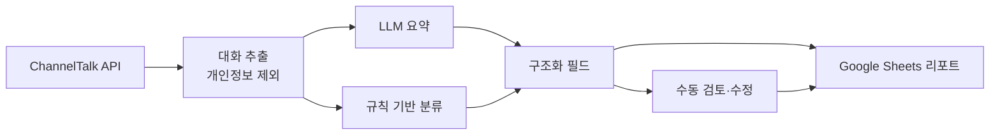

# 시스템 구조 — VOC Counseling Analyzer

← [개요](README.md)

---

## 전체 흐름



전체가 **데스크톱 앱 하나**로 패키징되어 실행됩니다.

---

## 수집

ChannelTalk API로 상담 대화를 추출합니다. 이 단계에서 **개인정보를 걸러냅니다.** 요약과 분류에 필요하지 않은 정보를 모델에 넘기지 않는 것이 원칙입니다.

상담 데이터는 양이 많아 한 번에 처리하지 않고 배치로 나눕니다. **중단된 배치는 이어서 재개**할 수 있게 만들었습니다. 수백 건을 처리하다 중간에 실패하면 처음부터 다시 하는 구조는 실제로 쓸 수 없습니다.

---

## LLM과 규칙의 분담

| 작업 | 담당 | 이유 |
|---|---|---|
| 요약 | LLM | 문맥을 읽고 핵심을 뽑는 일 |
| 항목화 | LLM | 자유 서술에서 구조를 추출 |
| 운영 분류 | 규칙 | 고정된 분류 체계가 이미 존재 |

**분류를 규칙으로 둔 이유.** 조직에는 이미 쓰는 문의 분류 체계가 있습니다. 모델이 매번 판단하면 같은 유형의 상담이 실행마다 다르게 분류될 수 있고, 그러면 **기간별 통계를 낼 수 없습니다.**

"이번 달에 배송 문의가 늘었는가"에 답하려면 분류가 안정적이어야 합니다. 안정성이 필요한 곳에는 결정론적 규칙을 씁니다.

**프롬프트 버전 관리.** 요약 품질을 조정할 때마다 프롬프트가 바뀝니다. 어떤 버전으로 만든 결과인지 추적할 수 있게 버전을 기록합니다. 결과가 갑자기 나빠졌을 때 무엇이 바뀌었는지 확인할 수 있어야 합니다.

---

## 사람의 개입 지점

자동 생성된 요약과 분류를 **검토하고 수정할 수 있는 단계**를 남겼습니다.

LLM 요약은 대체로 정확하지만 항상 그렇지는 않습니다. 완전 자동화로 두면 틀린 요약이 그대로 리포트에 올라가고, 한 번 그런 일이 생기면 담당자는 전체 결과를 믿지 않게 됩니다.

검토 단계가 있으면 틀린 것을 고칠 수 있고, **고칠 수 있다는 사실 자체가 도구를 계속 쓰게 만듭니다.**

---

## 배포 — 데스크톱 패키징

이 시스템의 특이점입니다.

```
Streamlit GUI  →  PyInstaller  →  실행 파일
```

**왜 웹 서비스가 아닌가.**

| 방식 | 도입 시 필요한 것 |
|---|---|
| 웹 서비스 | 서버 구축, 계정 발급, 접근 권한, 사내 보안 검토 |
| 데스크톱 앱 | 파일 실행 |

사용자는 비개발자이고, 도구 하나 쓰자고 넘어야 할 문턱이 많으면 대부분 거기서 멈춥니다. 실행 파일 하나로 만든 것이 이 도구가 실제로 쓰이게 된 이유였습니다.

Streamlit은 원래 웹 프레임워크지만, PyInstaller로 묶으면 로컬에서 브라우저를 띄우는 실행 파일이 됩니다. 개발 편의(Streamlit의 빠른 UI 구성)와 배포 편의(단일 실행 파일)를 함께 가져간 선택입니다.

---

## 출력

결과는 **Google Sheets**로 보냅니다.

새 대시보드를 만들지 않은 이유는 담당자들이 이미 스프레드시트로 일하고 있었기 때문입니다. 익숙한 도구로 결과가 오면 새로 배울 것이 없고, 거기서 바로 필터링하고 피벗하고 공유할 수 있습니다.

---

*클라이언트 정보, 상담 데이터, 실제 분류 체계는 [비공개 처리 기준](../../docs/how-to-read.md#비공개-처리-기준)에 따라 제외했습니다.*
